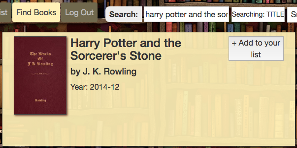
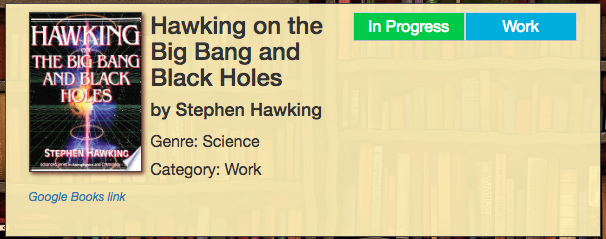
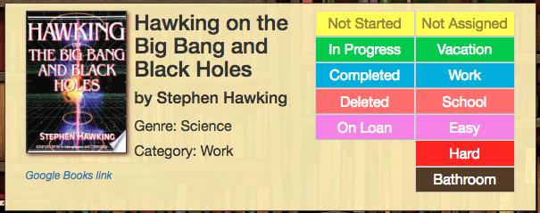
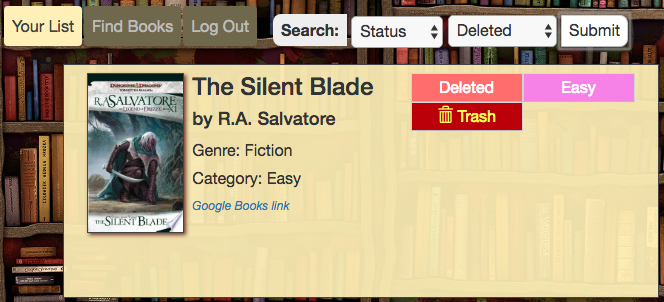

# bookmark
Application to create and track reading lists for users.

## Purpose
Allows the avid reader to find books and add them to a personal reading list, tracking completion status and category. Demonstrates use of Sequelize, Handlebars, Express, and more.

## Getting Started

You should be able to download the files via the github pages link below and run locally on your computer:

[https://github.com/emswann/bookmark.git](https://github.com/emswann/bookmark.git).

The application has also been published on Heroku:

[https://bookmark-gt.herokuapp.com/](https://bookmark-gt.herokuapp.com/).

## Local Installation
### .env setup
When locally hosted, Bookmarks requires a .env file to contain MYSQL database information, and an API key for Google Books. Include the following information as environment variables:
```
MYSQLDB_URL=mysql://<username>:<password>@localhost:<port>/<database>
PORT=<port>
GBOOKS_API_KEY=<google books api key>
```

### Database setup
You may use the Sequelize Command Line Interface to establish a MYSQL database and populate it with the included migrations and seeds. Refer to the Sequelize documentation for more information, but the basic procedure is as follows:
```
$ sequelize db:create
$ sequelize db:migrate
$ sequelize db:seed:all
```

You may also include some test seeds with an additional CLI line:
```
$ sequelize db:seed:all --seeders-path "seeders/test"
```
This procedure will create `database_db`.

## Usage
Upon logging in with a freshly created account, the user will have an empty "reading list" and the opportunity to search for books via the Google API. Books may then be added to the reading list.



The book will have "completion status" and "category" fields available to them once in the reading list.



Click on the current status or category to change it. The reading list may then be filtered by status or category.



When a book is assigned "Deleted" status, it is removed from all list views unless the user specifically chooses to view "Deleted" books only. In this view, "Deleted" books are also granted a "Trash" button, which will remove the book from the reading list completely. (It may be found again in the "book search" area if desired.)



## Built With

* [Google Books API](https://developers.google.com/books/) - Google API containing all book content for application.
* [Bootstrap](https://getbootstrap.com/docs/3.3/) - Front-end HTML, CSS, javascript framework for creating responsive web applications. 
* [JavaScript](https://www.javascript.com/) - Programming language.
* [jQuery](https://jquery.com/) - Javascript library.
* [node.js](https://nodejs.org/en/) - Server side programming language.
* [express](https://www.npmjs.com/package/express) - Web application framework used for server side routing.
* [express-handlebars](https://www.npmjs.com/package/express-handlebars) - Middleware template engine used to render HTML templates.
* [EJS](https://www.npmjs.com/package/ejs) - Middleware template engine used to render HTML templates.
* [@datafire/google_books](https://www.npmjs.com/package/@datafire/google_books) - Middleware providing interface to Google Books API.
* [mySql](https://www.npmjs.com/package/mysql) - node.js driver for mySql.
* [Sequelize](http://docs.sequelizejs.com/) - Promised based ORM for Node.js.
* [Passport](http://www.passportjs.org/docs/) - Express-compatible authentication middleware for Node.js.
* [Chai](http://www.chaijs.com/) - BDD / TDD assertion library for Node.js.
* [Mocha](https://mochajs.org/) - BDD / TDD test framework for Node.js.
* [Nightmare](https://www.npmjs.com/package/nightmare) - High-level browser automation test library.
* [express-session](https://www.npmjs.com/package/express-session) - Simple session middleware for Express.
* [passport-local](https://www.npmjs.com/package/passport-local) - Local username and password authentication strategy for Passport.
* [bcrypt-nodejs](https://www.npmjs.com/package/bcrypt-nodejs) - Native JS bcrypt library for Node.js.
* [connect-flash](https://www.npmjs.com/package/connect-flash) - Flash message middleware for Connect.
* [chai-http](https://www.npmjs.com/package/chai-http) - Extends Chai Assertion library with tests for http apis.
* [body-parser](https://www.npmjs.com/package/body-parser) - Middleware parser used for incoming request bodies.
* [dotenv](https://www.npmjs.com/package/dotenv) - Loads environment variables from .env file.
* [path](https://www.npmjs.com/package/path) - Path module for Node.js.

## Credits
- Matt Haddock
- Denton Kerr
- Elaina Swann
